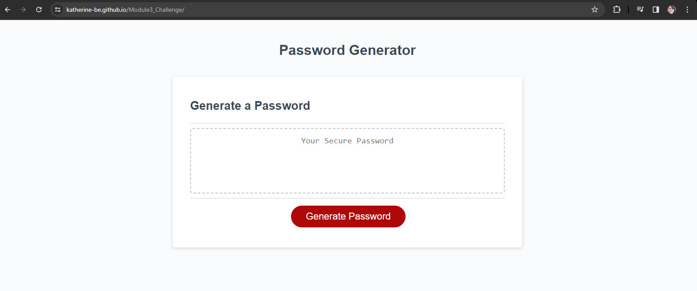

#Module3_Challenge

##This is a website used to generate a password based on requirements.

##Table of Contents:
    index.html
    script.js
    style.css

##Link to website: https://katherine-be.github.io/Password_Generator_Challenge/

'''md
'''

     Mimo - a mobile app for learning JS
     W3 - a resource for learning to code
     Tutor - Joem Casusi
